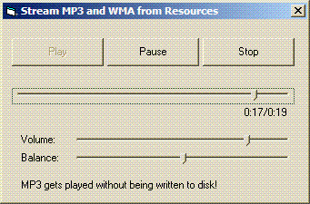



## Stream MP3/WMA from resources

### Description

This shows how to play MP3s and WMAs directly from resources without writing them to disk first.

For decoding it uses the functions of the Windows Media Format SDK v9, wich ships with all Windows Media Players &gt;= v9 (or google for "wmfdist.exe").

It allocates some memory, copies the sound from the resource to that memory,

and plays it using DirectSound. You can control volume, balance and position.

As the DirectSound stream uses an Windows API timer,

debugging is pretty hard. You might be better off if you put the whole playback stuff into a DLL.
 
### More Info
 

             |
---                |---
**Submitted On**   |2006-11-06 15:16:16
**By**             |[Arne Elster](https://github.com/Planet-Source-Code/PSCIndex/blob/master/ByAuthor/arne-elster.md)
**Level**          |Advanced
**User Rating**    |5.0 (10 globes from 2 users)
**Compatibility**  |VB 6\.0
**Category**       |[Sound/MP3](https://github.com/Planet-Source-Code/PSCIndex/blob/master/ByCategory/sound-mp3__1-45.md)
**World**          |[Visual Basic](https://github.com/Planet-Source-Code/PSCIndex/blob/master/ByWorld/visual-basic.md)
**Archive File**   |[Stream\_MP32029381162006\.zip](https://github.com/Planet-Source-Code/arne-elster-stream-mp3-wma-from-resources__1-67020/archive/master.zip)

